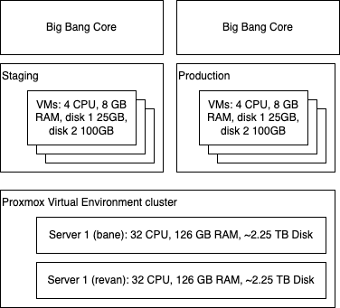

# all-the-things

> "My Mission in life is not merely to survive, but to thrive; and to do so with some passion, some compassion, some humor, and some sytle" - Maya Angelou

^^^^ That ^^^^ but a homelab/work/automated/secure software technology way.

And, here. we. go.

## Architecture

Zarf package with Big Bang Core components, deployed onto an n-node cluster. One for Staging and one for Production.

## High Level Tactical - zero to hero

1. Manual install and clustering of Proxmox
2. Terraform provision Staging cluster
3. `zarf init && zarf package deploy...`
